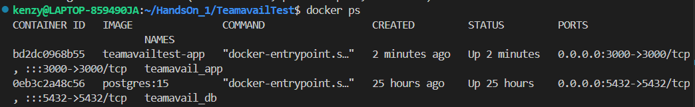
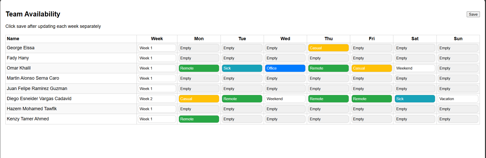
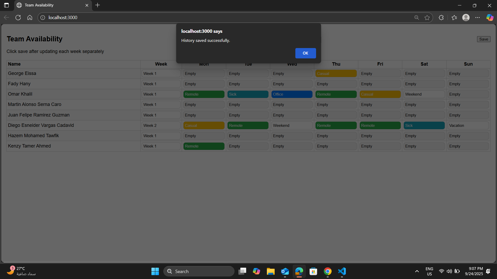

# TeamavailTest – CI/CD with Docker, PostgreSQL, Terraform, and Jenkins

## 📌 Overview
This project is a **Team Availability Tracker** application.  
It consists of:
- A **Node.js Express app** (`server.js`) that serves the frontend and backend.
- A **PostgreSQL database** for persistence.
- A **CI/CD pipeline** powered by **Jenkins** and **Docker**.
- **Terraform** for infrastructure provisioning.

---

---

## ⚙️ Application Workflow
1. User interacts with the frontend served by **Express**.
2. Input JSON files are processed.
3. Data is stored in:
   - **PostgreSQL database** (primary storage).
   - **history.json** file inside the `/output` directory (backup/history).
4. User can view results in the web UI.

---

## 🐳 Docker & Docker Compose

### **Dockerfile (App)**
- Builds the Node.js Express app.
- Installs dependencies.
- Exposes port `3000`.

### **docker-compose.yml**
Defines two services:
1. **App service**
   - Runs Node.js Express app.
   - Maps port `3000:3000`.
2. **PostgreSQL service**
   - Uses `postgres:15`.
   - Environment variables set with:
     ```yaml
     POSTGRES_USER: teamuser
     POSTGRES_PASSWORD: teampass
     POSTGRES_DB: teamdb
     ```
   - Exposes port `5432`.

#### Run the stack:
```bash
docker compose up --build -d
```
when running the docker compose the image is build and postgres database is connected sucessfully 


## Data Saved
now when chaning any thing in the data, it is changed in the history.json file and the postgres 





## Problems Solved 

### Data saving in postgres problem 
Problem: Data Wasn’t Saved in Postgres

At first, the application only wrote the data into the output/history.json file, and nothing was being stored inside Postgres.
When checking the database with:
```bash
docker exec -it teamavail_db psql -U teamuser -d teamdb
\dt;
``` 
Solution: Add Postgres Service in Docker Compose

The issue was fixed by explicitly adding a Postgres service in the docker-compose.yml file
Postgres runs as part of the project stack, and the backend (server.js) can connect to it properly.